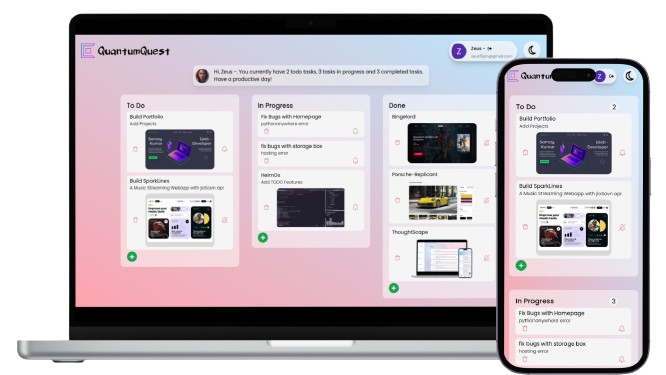

# Quantum Quest - Real-time Task Tracker


Quantum-Quest is a simple yet effective real-time task tracking application built using React and Firebase. Designed as a learning project, it provides users with an easy way to add, manage, and delete tasks while ensuring a seamless user experience.

## Features
- **User Authentication:** Google Sign-In for secure authentication.
- **Real-time Task Management:** Add, edit, and delete tasks instantly with Firebase Realtime Database.
- **Dark Mode Support:** Built-in theme switcher for light and dark mode.
- **Progress Tracking:** Easily track tasks as they are completed.
- **PWA Support:** Works fine as a Progressive Web App

## Technologies Used

- **Frontend:** React, Tailwind CSS
- **Backend:** Firebase Realtime Database
- **Authentication:** Firebase Authentication (Google Sign-In)
- **Hosting:** Firebase Hosting

## Installation & Setup

1. Clone the repository:
   ```sh
   git clone https://github.com/samay15jan/quantum-quest
   cd quantum-quest
   ```
2. Install dependencies:
   ```sh
   npm install
   ```
3. Set up Firebase:
   - Create a Firebase project.
   - Enable Authentication (Google Sign-In).
   - Set up Realtime Database.
   - Update Firebase configuration details in `/src/components/firebase.js`.
4. Start the development server:
   ```sh
   npm start
   ```

## Deployment
Quantum-Quest is hosted on Firebase Hosting. To deploy:
```sh
firebase deploy
```

## Contributing
Feel free to fork the repo, open issues, or submit pull requests if you’d like to improve Quantum-Quest!

## License
Quantum-Quest is licensed under the [MIT License](https://opensource.org/licenses/MIT).
